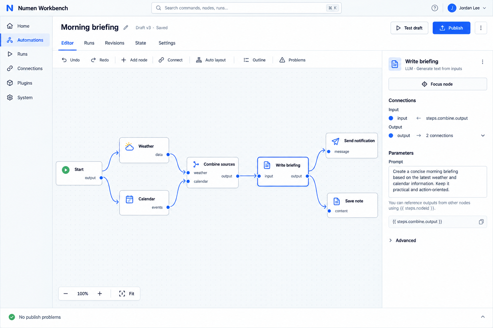
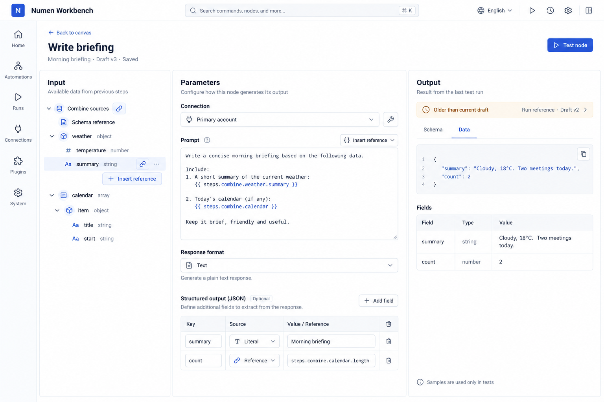
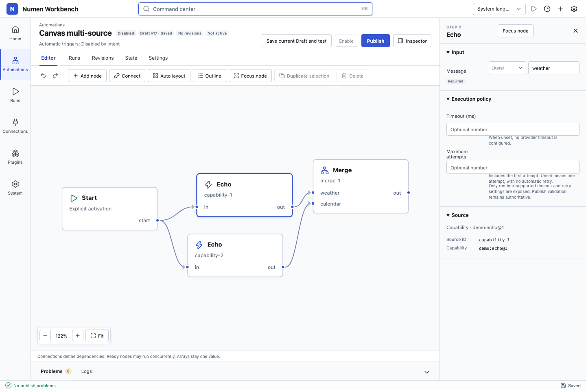
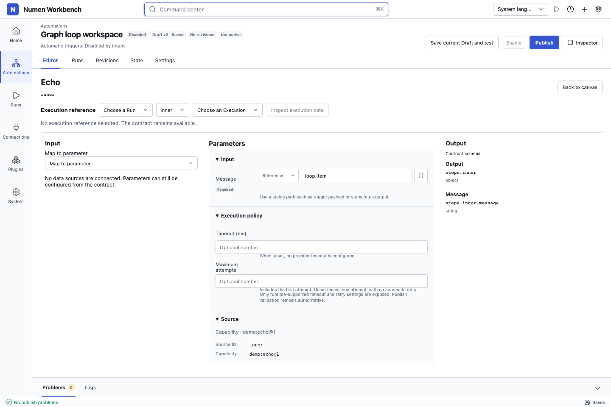
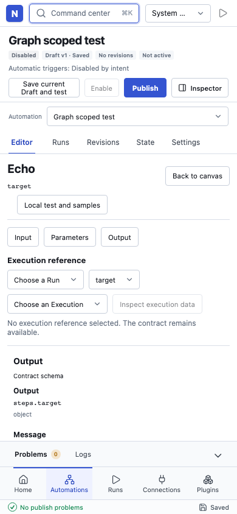
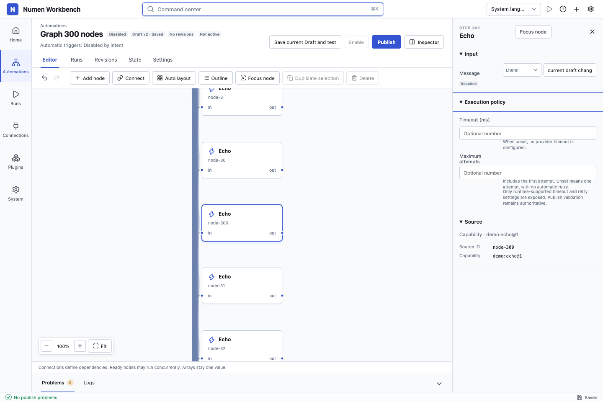
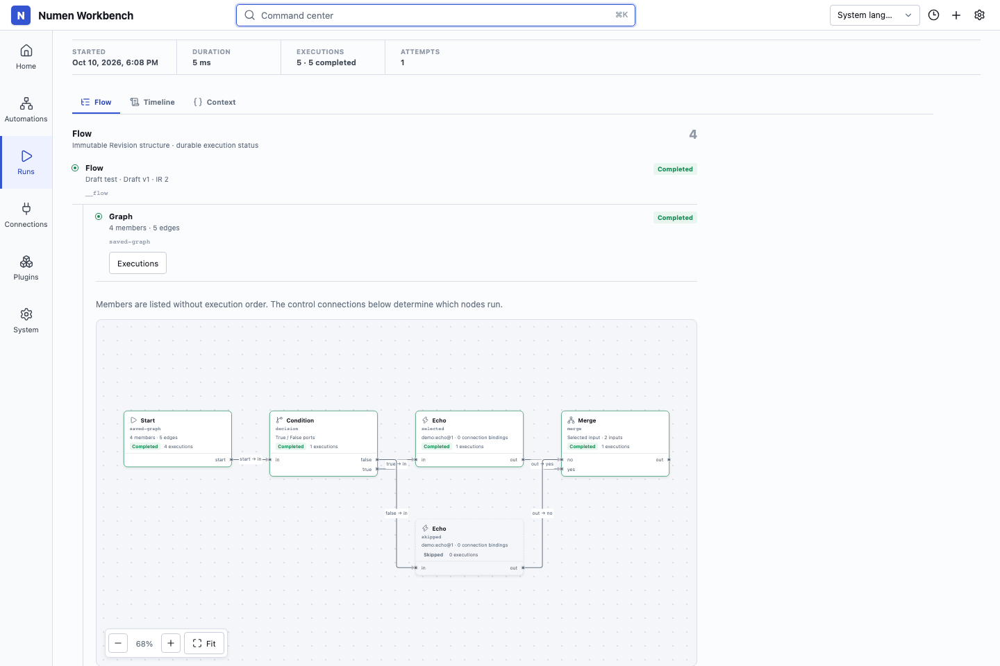

# 26. Graph 画布交互与实现记录

本轮遵循 [已确认的执行基线](25-graph-workflow-editor-decision.md)。本记录区分交互设计、已实现部分和实际验证；阶段测试不能替代最终端到端验收。

## 1. 完整编辑区

画布占据主要编辑区。沿用 Workbench 的 76px 全局导航、白色面板、蓝色强调、细边框和现有组件；进入图流程时收起 Automation 列表，仍可通过导航重新展开。标题、保存状态、测试、发布和已有页签保持原位置。



概念图提供画布与紧凑检查器的比例、节点轮廓和端口关系。实际产品复用现有品牌及导航，不引入概念图中的虚构账号。节点正文显示名称、身份和端口；参数全文留在检查器。大纲、连线表单和节点目录按需打开。端口表单提供鼠标拖拽的替代方式；选中连接可重连、断开或插入节点。

节点聚焦态为输入、参数、输出三个相邻区域。输入与输出必须标明 Schema、固定样例或具体 Run 的来源；历史输出与草稿不同时显示旧版本提示。窄屏切换单个区域，退出聚焦返回同一节点和原视口。



概念中的天气、日程与简报是布局示例。真实字段以 Capability 契约为准，未知路径保持未验证状态。局部测试与样例入口已连接真实 Console 接口和耐久运行管线。

## 2. 状态归属和操作规则

| 状态/操作 | 所有者与提交时机 |
|---|---|
| 节点、端口、依赖、参数 | AutomationSource；领域命令一次修改 |
| 节点位置 | Presentation `graphPositions[graphId][nodeId]` |
| 视口、框选、悬停、拖动中位置 | 组件会话；不触发保存 |
| 拖动结束、批量布局 | 一次 Presentation 修改、一个 Undo 项 |
| 保存、冲突和 Undo/Redo | 原有 `useAutomationDraftDocument`，保留保存期间的新编辑 |
| 选中、输入草稿 | 原有输入保护；陈旧 Source 捕获不能应用拖拽结果 |
| 执行状态 | 固定 Run 的实际成员/Execution 事实，不回写 Source |

新增成员默认断开。用户明确连到 `start` 后才可激活；断开末条入边不会自动改为入口。删除节点清理所属边，其他表达式保留悬挂引用并报告问题。复制重写所复制子图内部引用，外部引用保留。Merge 删除仍有连接的端口时要求先断开。

## 3. 画布组件

采用 Vue Flow 1.48.2 做交互投影，使用 `applyDefault=false`、显式事件与自定义节点。其[受控变更](https://vueflow.dev/guide/controlled-flow.html)和[具名 Handle](https://vueflow.dev/guide/handle.html)允许将拖动、连接与领域命令分开。底层 `Node/Edge` 只包含位置、显示数据及 Source 端口映射。连接端点不决定隐藏依赖。

样式从宿主 Shell 加载，随动态 Workbench Entry 一同出现的画布仍有完整基础样式。大图采用可见节点渲染，大纲搜索可将远端节点定位到正常缩放比例。100/300 节点及跨浏览器结果见下方验收记录；这些代表性测试不构成无限容量或设备帧率承诺。

## 4. G1 实际结果

2026-10-10，独立运行 Core、Automation、Database、Scheduler、固定图投影和恢复相关套件，27 个文件 275 项通过。之后增加真实双 Scheduler 竞争与协议误标回归，Scheduler + Database 的 12 个文件 94 项通过，Scheduler 类型检查通过。

双 Scheduler 回归先复现旧 Attempt 迟到成功覆盖新 generation，再验证成功、失败、超时、资源归属、取消意图持久化窗口均受事务门禁保护。共享节点、交叉依赖提前就绪、分支 skip、null/空数组、unsafe Outcome Unknown、SQLite 重开及旧快照执行已通过对应集成测试。

真实 Chromium 运行固定 Graph 的只读检查：完成 Run、Skipped 成员零次 Execution、明确端口边、节点到 Execution 定位、固定 Snapshot、1440px/390px、刷新无写入；页面及 console 错误为空。此时只读图为成员与端口连接列表，最终画布与长流程验收仍待 G2/G5。

已提交：`41a3007`（编译与快照）、`676876c`（耐久调度与 Attempt 门禁）、`8867760`（查看、比较与恢复）。

## 5. 完整实现与第一版边界

- G2：Vue Flow 受控画布、显式入口、具名端口、连接/重连/插入/断开、复制/删除、布局、搜索定位和整份文档 Undo/Redo。
- G3：Object/Array 成员表达式、统一集合与条件函数；输入/参数/输出聚焦；Connection 就地创建/修复返回；显式循环及有序收集。
- G4：独立样例持久化，人工输入或完整 Execution 导入；实际调用/替代/外部写入预览，固定局部 TEST 快照与幂等接受。
- G5：保守转换副本；固定图只读拓扑、节点定点读取、差异分页、完整恢复；长流程、离线保存、并发冲突与 Entry 重载验收。

样例只支持根 Graph 的普通 Capability，单份完整值至多 1 MiB，每个 Automation 至多 1000 份，列表按 50 条 SQL 分页。导入仅接受服务端完整成功输出，冻结契约必须允许公开检查全部字段；含 ResourceRef、脱敏/截断占位或不满足契约的值拒绝保存。样例值不出现在目录列表中。局部测试请求、所选样例和固定快照有合计 8 MiB 预算。

局部测试首版只开放普通 Capability 无环子图：执行至节点计算显式依赖和引用闭包；只执行节点要求上游样例完整且目标固定输入满足契约。Condition、Merge、ForEach 边界和循环内单次迭代测试明确拒绝。正式发布和触发运行不读取样例。结果未知时通过原 requestId 恢复已接受请求，不自动重放不安全外部写入。

转换仅支持单 Capability 或无显式 Block 输出的平坦 Capability 序列；If/Parallel/Race/Wait/ForEach、扩展控制、嵌套结构及不安全身份保留旧编辑器，拒绝无证明的转换。创建的是可编辑 Graph 副本，原 Draft、Revision、Run 快照和激活状态保持原值。

## 6. 可重复验收

`e2e/automation-graph-canvas.spec.ts` 使用临时真实 Runtime、SQLite、Console 认证和生产构建：

1. 从空流程经 UI 建立双来源汇合图，拖动布局并撤销/重做、保护 Start、删除节点及所属边一次撤销、断线保留参数且阻止编译、刷新并执行保存 Draft。
2. 编辑显式循环并发，进入循环体，聚焦后返回原视口；真实输出按输入顺序收集。
3. 经 UI 固定上游样例，只调用目标节点，不执行下游通知；样例 Execution 标识与零 Provider Attempt 在后端回归确认。
4. 100/300 节点实际执行并编辑末端，按 ID 读取固定 Snapshot/Run；300 项差异分页往返，完整恢复与一次 Undo，历史快照及激活状态不变。
5. 离线保存失败后重试、两个标签页争用同一 Draft 版本、保留冲突输入、Workbench Entry 卸载/重载。
6. 非法 Merge 端口字段在取消导航后保留，重连与连线上插入各为一个 Undo 项。

`e2e/automation-graph-conversion-connection.spec.ts` 覆盖 Block/单 Capability 转换副本与 If 拒绝，以及真实 Adapter/Slot 的 Connection 创建、修复、焦点和视口返回、另一个 Slot 不变、保存重载与实际调用。

已创建转换副本后，原 Draft 仍处于保存中时打开副本也必须经过离开保护；取消保留原文档，保存结束后打开的仍是转换当时的固定副本。

`e2e/automation-graph-inspection.spec.ts` 检查实际 Vue Flow 节点/端口、Completed/Skipped 事实、Execution 定位、固定 Snapshot、桌面/手机和刷新无写入。

后端回归额外复现后修复了：未知协议导入前解析、无替代值时漏查局部测试版本、跨 Context Schema UID 导致错误过期、Console 重载 Provider 未恢复，以及双 Scheduler/双 Context 接受竞争。界面回归覆盖已发请求的离开保护、转换固定请求与预览一致、卸载后迟到响应不得重写输入会话。

完整浏览器回归发现并修复 Execution 筛选误裁剪流程的问题：`sourceNodeId` 只筛选 Execution，`flowNodeId` 单独控制固定节点读取。普通定位保留可见的同级节点，超出当前投影时再定点读取；Graph 清单会展开并把焦点移到目标。既有底部面板快捷键测试也补充等待动态 Entry 就绪，避免在快捷键尚未注册时操作。

2026-10-10 最终源码冻结后实际运行：

| 检查 | 结果 |
|---|---|
| `pnpm build` / `pnpm build:examples` | 通过，含生产 Workbench 与独立插件构建 |
| `pnpm typecheck` | 通过 |
| `pnpm test` | 151 个文件、1195 项通过 |
| `pnpm exec playwright test` | Chromium 全量 120 项通过，4.0 分钟 |
| Graph 三个浏览器文件及 `run-data.spec.ts`，`--browser=firefox` | Firefox 14 项通过，52.7 秒 |
| Graph 三个浏览器文件的独立严格 NodeNext 类型检查 | 通过 |
| `git diff --check` | 通过 |

浏览器使用临时 Runtime 和 SQLite，运行新生产构建。全量 Chromium 之前同一构建的 Graph + Run data 定向 14 项也通过；最终全量中包含这 14 项，未把重复运行计成额外覆盖。Firefox 命令为：

```sh
pnpm exec playwright test e2e/automation-graph-canvas.spec.ts e2e/automation-graph-conversion-connection.spec.ts e2e/automation-graph-inspection.spec.ts e2e/run-data.spec.ts --browser=firefox
```

构建仍有 Vite 的 500 kB chunk 提示：`core-entry.js` 为 539.28 kB，gzip 155.02 kB。100/300 节点验证涵盖真实编辑、保存、执行和历史末端读取；未将其表述为帧率基准或无限规模保证。

## 7. 实际界面

以下截图来自本轮真实 Runtime、临时 SQLite 与生产前端构建，已逐张检查；与第 1 节概念图分开保存。











## 8. 分步提交

分支：`codex/graph-workflow-editor`；起点：`f1e63be`。

| 提交 | 内容 |
|---|---|
| `5386370` | G0 差距、决策稿与验收计划 |
| `ac61be0` | 记录用户确认的 Graph 执行与调试基线 |
| `a3c9a3b` | 统一比较、集合与条件函数 |
| `09e79a0` | Object/Array 混合表达式编辑 |
| `41a3007` | Graph 编译、协议与固定快照 |
| `676876c` | 耐久图调度与迟到 Attempt 门禁 |
| `8867760` | 固定 Graph 检查、比较与恢复 |
| `e849de2` | 显式循环及有序结果收集 |
| `c47bb6b` | 原子图命令、Presentation 与文档历史 |
| `52292f1` | 独立持久化样例与固定局部测试 |
| `be49224` | Console 接口、长图点读与差异分页 |
| `ad85830` | 分离 Execution 筛选与 Flow 点读 |
| `26bf322` | 实际画布、节点聚焦、Connection 返回及调试界面 |

本记录与真实浏览器用例、截图另作最终验收提交。原始设计提案、下一阶段计划与已有未跟踪图片保持原状，不混入提交；本轮未推送远端。
